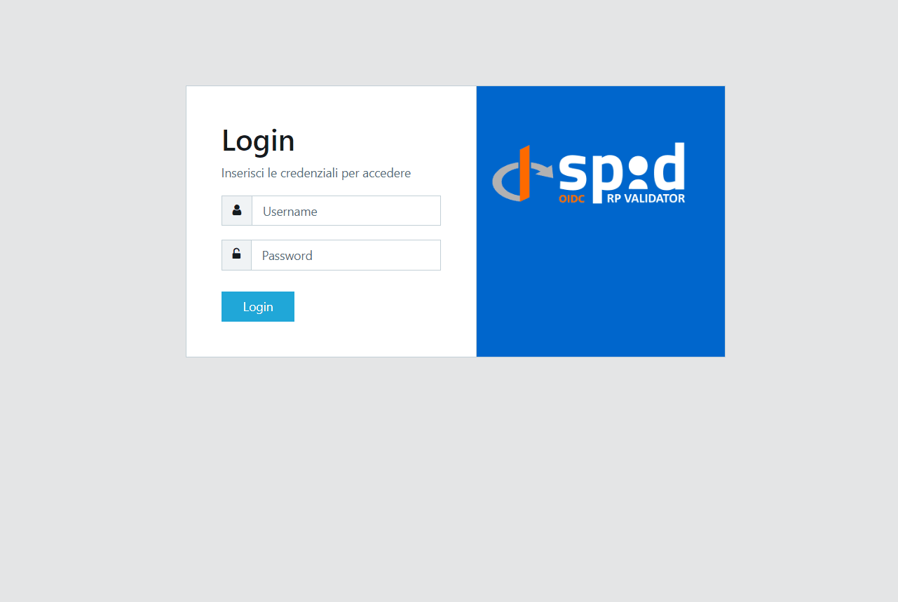

# spid-oidc-check-rp
SPID OIDC Conformance Test Tool for Relying Party



## Requirements
- Node.js v.14

## Setup
clone the repository
```
git clone https://github.com/AgID/spid-oidc-check-rp.git
cd spid-oidc-check-rp/src
```
copy and edit configurations
```
cp -R config_sample config
```
create Relaying Party signing and encryption certificates
```
cd config && sh make_cert.sh && cd .. 
```
create directory for database
```
mkdir data
```
configure same base path [at least '/'] on
 - src/client/src/config.json
 - src/config/server.json
 - src/config/op.json


compile and build the client
```
cd client && npm i && npm run build && cd ..
```
compile the server
```
cd server && npm i && cd ..
```

## Run
```
node server/spid-oidc-check-rp
```

## Use Docker
clone the repository
```
git clone https://github.com/AgID/spid-oidc-check-rp.git
cd spid-oidc-check-rp
```
build
```
docker build -t spid-oidc-check-rp .
```
run
```
docker run -t -i -p 8083:8083 spid-oidc-check-rp
```